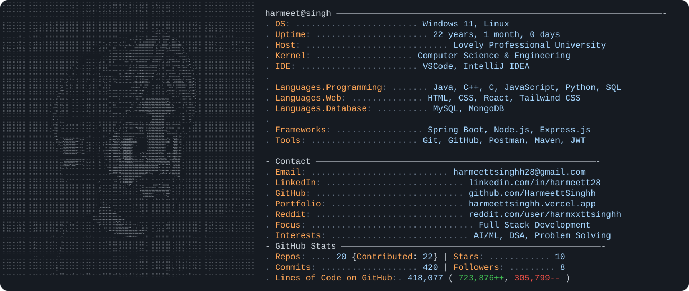

<h1 align="center">Harmeet Singh</h1>

  Computer Science & Engineering Student | Full Stack Developer | AI/ML Enthusiast

  <a href="https://www.linkedin.com/in/harmeett28">LinkedIn</a> •
  <a href="https://github.com/HarmeettSinghh">GitHub</a> •
  <a href="https://x.com/harmeettsingh">X</a> •
  <a href="mailto:harmeettsinghh28@gmail.com">Email</a>

  <picture>
    <source media="(prefers-color-scheme: dark)" srcset="./dark_mode.svg">
    <source media="(prefers-color-scheme: light)" srcset="./light_mode.svg">
    
  </picture>

## About Me

- B.Tech Computer Science and Engineering student at Lovely Professional University
- Interested in full-stack development, AI/ML, data structures, and problem solving
- Focused on building reliable and practical software projects

## Tech Stack

**Languages:**  
Java • C++ • C • JavaScript • Python • SQL

**Frontend:**  
HTML • CSS • React • Tailwind CSS

**Backend:**  
Spring Boot • Node.js • Express.js

**Databases:**  
MySQL • MongoDB

**Tools:**  
Git • GitHub • Postman • Maven • JWT